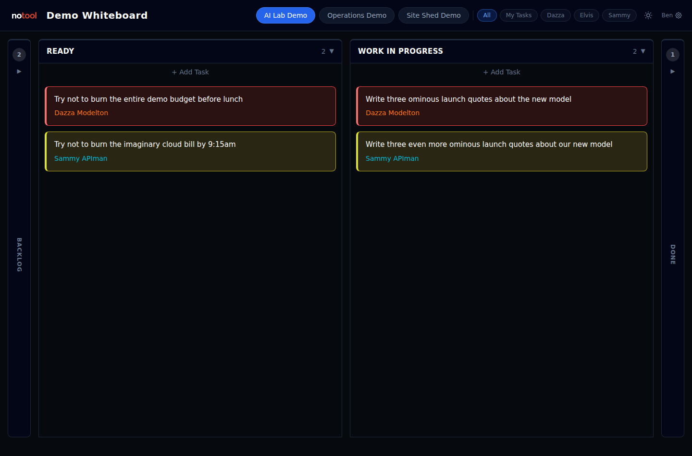
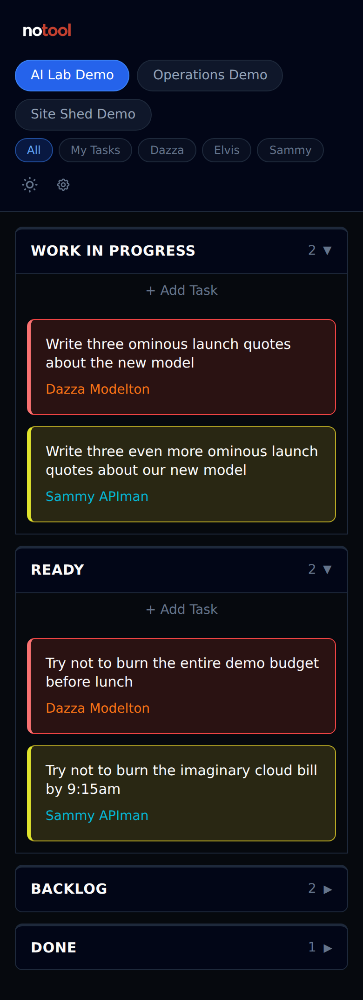
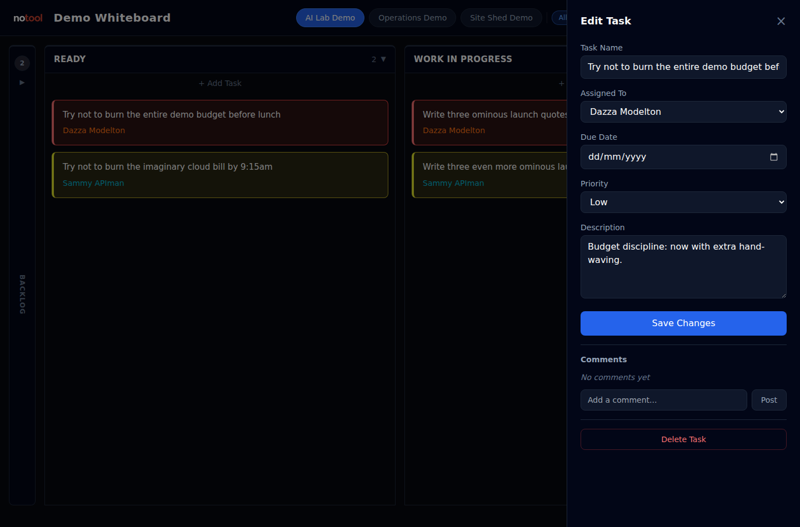

# Kanboard Whiteboard

A clean, minimal task board for [Kanboard](https://kanboard.org/). It wraps Kanboard in a simpler, prettier whiteboard-style interface for day-to-day task handling on any device.

Built for my own business ([notool.au](https://notool.au)). Shared because it solved a real problem and might solve yours too.

## What It Does

- **Kanban columns** — drag tasks between Backlog, Ready, In Progress, Done
- **Multi-project** — switch boards via tabs, per-user project visibility
- **Magic link auth** — no passwords, one-time login links with session cookies
- **Mobile-first** — collapsible columns, back button, PWA installable
- **Dark/light theme** — respects your palette, toggleable per user
- **Task comments** — inline comment panel with user attribution
- **Admin panel** — user management, magic link generation, activity log
- **Docker ready** — `docker compose up -d` and you're running

## Architecture

```
Browser → Whiteboard (Node.js + SQLite auth) → Kanboard (PHP + SQLite/MySQL)
```

The whiteboard is a Kanboard API client. It does not touch your Kanboard database directly, so Kanboard remains the source of truth and other API clients keep working.

## Quick Start

```bash
git clone https://github.com/bigmuzb/kanboard-whiteboard.git
cd kanboard-whiteboard

# Configure
cp .env.example .env
# Edit .env — at minimum, set KANBOARD_KEY (your Kanboard API token)

# Run
docker compose up -d
# Open http://localhost:3000
```

Your Kanboard API token is in Kanboard → Settings → API.

## Screenshots

Desktop board overview:



Mobile board view:



Task details and comments:



## Demo

A reusable fake-data demo pack is included for screenshots and local evaluation. The demo source is part of this repo: `demo/sample-data.json`, `scripts/seed-demo.js`, and `docker-compose.demo.yml`.

Hosted demo: https://whiteboard-demo.notool.au

```bash
docker compose -f docker-compose.demo.yml up -d --build
docker compose -f docker-compose.demo.yml logs demo-seed
```

See [docs/DEMO.md](docs/DEMO.md) for reset instructions, sample data notes, and public-sandbox guidance. The hosted demo uses fake data, allows basic card movement, blocks admin/destructive actions, and resets regularly.

## Configuration

`.env` file (see `.env.example`):

| Variable | Default | Description |
|----------|---------|-------------|
| `BRAND_NAME` | `Kanboard Whiteboard` | Header text, PWA name |
| `KANBOARD_USER` | `jsonrpc` | Kanboard API username |
| `KANBOARD_KEY` | — | Kanboard API token (required) |
| `PORT` | `3000` | Host port |
| `UMAMI_SCRIPT_URL` | blank | Optional Umami script URL for the instance operator |
| `UMAMI_WEBSITE_ID` | blank | Optional Umami website ID |
| `UMAMI_DOMAINS` | blank | Optional comma-separated host allowlist for Umami tracking |

## First Login

On first run, an admin user is seeded (kanboard_user_id=1). Generate a magic link:

```bash
docker compose exec ca-board node -e "
const auth = require('./auth'); auth.init();
const link = auth.createMagicLink(1, 'setup', 0);
console.log('http://localhost:3000/auth/login?token=' + link.token);
"
```

Click the link. You're in. No passwords.

Add more users via the admin panel at `/admin` or via the API.

## How Auth Works

- **Magic links** — one-time use tokens, generated by admin
- **Sessions** — 30-day cookies, no passwords anywhere
- **Project isolation** — each user sees only their assigned projects
- **Admin panel** — user CRUD, link management, activity log

## Files

| File | Purpose |
|------|---------|
| `server.js` | Node.js server — static files, API proxy, auth routes |
| `auth.js` | SQLite auth module — users, magic links, sessions |
| `app.js` | Frontend application logic (~1200 lines) |
| `index.html` | Board page |
| `admin.html` | Admin panel |
| `login.html` | Magic link login page |
| `style.css` | Custom styles (extends Tailwind CDN) |
| `config.js` | Dynamic frontend config (served from env vars) |
| `Dockerfile` | Node 22 container for the whiteboard |
| `docker-compose.yml` | Kanboard + Whiteboard stack |
| `setup.sh` | Interactive first-run script |

## Versioning

This project uses normal semantic versioning for the whiteboard app itself:

- `MAJOR` - breaking changes to configuration, deployment, auth, or API behaviour
- `MINOR` - compatible features and visible UX improvements
- `PATCH` - bug fixes, documentation, compatibility notes, and small polish

Kanboard compatibility is tracked separately from the app version. A release can say, for example:

- `Kanboard Whiteboard v1.0.1`
- `Latest Kanboard tested: v1.2.52`

That keeps the app version honest while still making it obvious which Kanboard version has been smoke-tested most recently.

## Kanboard Versions Tested

| Kanboard version | Test coverage |
|------------------|---------------|
| `v1.2.52` | Full live Docker smoke test against `kanboard/kanboard:latest` as of May 2026: auth, project listing, board load, comments, task create/delete, and API proxy. |
| `v1.2.37` | Compatibility smoke against the older Docker image: JSON-RPC auth, `getVersion`, and project-list API surface. |

The whiteboard uses standard JSON-RPC methods (`getAllProjects`, `getBoard`, `createTask`, `moveTaskPosition`, `createComment`, etc.) that have been stable across Kanboard versions.

If a Kanboard update breaks something, open an issue with the error and your Kanboard version.


## Acknowledgement

This project exists because [Kanboard](https://kanboard.org/) exists.

Kanboard, created and maintained for years by **Frédéric Guillot** and contributors, is an exceptionally solid, practical piece of open-source software. This whiteboard wrapper is not a replacement for Kanboard - it is a small companion interface built on top of Kanboard's excellent API and data model.

Huge thanks to the Kanboard project for doing the hard, unglamorous work that makes tools like this possible.

## Development Notes

This project was developed with AI-assisted tooling (Claude via [OpenClaw](https://openclaw.ai)). The code is straightforward vanilla JavaScript — no build step, no framework, no transpilation. If you can read JS, you can read this.

The AI handled most of the implementation. The human (Murray Booth) directed the architecture, tested on real users, and made the product decisions. The AI doesn't maintain this — Murray does, with AI assistance when needed.

## Scope

This is a frontend for Kanboard. It does:

- Clean kanban board with drag-and-drop
- Multi-project with per-user visibility
- Magic link auth with admin panel
- Mobile-first responsive design
- Dark/light themes

It does **not** do:

- Swimlanes, subtasks, file attachments, analytics
- Real-time sync (30-second auto-refresh)
- Multi-tenancy (one Kanboard instance, multiple projects)
- Email integration (Kanboard handles that natively)

If you want a feature, fork it. If the core board is broken in a way that affects basic task management, open an issue.

## Licence

MIT — see [LICENSE](LICENSE).

Kanboard is MIT Licensed. This project is independent and not affiliated with the Kanboard project.
